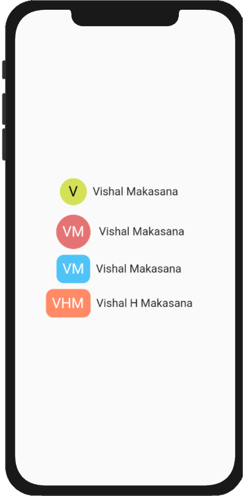

# text_drawable_flutter

A Flutter package for displaying initials in circle avatar same like android text drawable library.



## Import it

```dart
import 'package:text_drawable_flutter/text_drawable_flutter.dart';
```

## Use it

```dart
TextDrawable(
  text: 'Vishal Makasana',
  padding: EdgeInsets.all(12),
  length: 1,
)
```
## TextDrawable Properties
| Property | Type | Description |
| :--- | :---: | :--- |
| `text` | String | The full text you wish to display the initials for. Only the ```length``` initials will be displayed. |
| `height` | double | Height of the `TextDrawable` widget. |
| `width` | double | Width of the `TextDrawable` widget. Defaults to 48. |
| `backgroundColor` | Color | Background color to for the widget. If not specified, a random color will be generated. |
| `textStyle` | TextStyle| `TextStyle` for the `text` to be displayed. Default `fontSize` is 18. `color` is determined based on contrast with the `backgroundColor`. |
| `boxShape` | BoxShape | Shape of the widget. Defaults to `BoxShape.circle`. |
| `borderRadius` | BorderRadiusGeometry | Border radius of the widget. Only specify this if `boxShape == BoxShape.rectangle`. |
| `padding` | EdgeInsetsGeometry | Default is `EdgeInsets.all(8)`. To give space around text initials. |


## Example
Take a look at the [example](https://github.com/vishhmakasana/text_drawable_flutter/blob/main/example/lib/main.dart) file.


## License
This project has been licensed under the MIT License. Check the [LICENSE](LICENSE) file for the details.